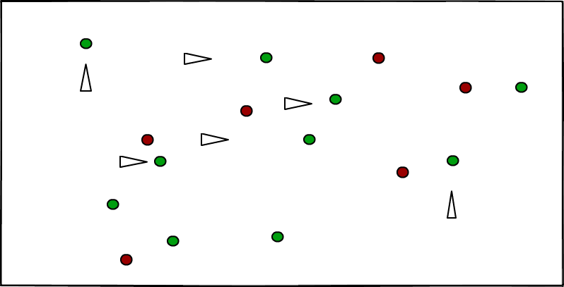

# Survival Particle
## Background and Overview
SurvivalParticle is a evolutionary system where evolving streeing agents to effectively eat food and avoid poison. The concept is base on [Steering Behaviors For Autonomous Characters](http://www.red3d.com/cwr/steer/) by Craig Reynolds, and its implementation is part of the genetic algorithms and intelligence learning.

## Wireframes

## Architecture and Techonologies
This project will be implemented with the following technologies:
- Vanilla JavaScript for Overall structure
- HTML5 Canvas for DOM manipulation and rendering
- P5 JS to help with drawing functionality and simulation.

There are two main scripts involed in this project:
- `app.js`: this script will handle the logic for  drawing and rendering the particles, food, and posion
- `particle.js`: this script will house the physics logic and the behaviors of particles.
